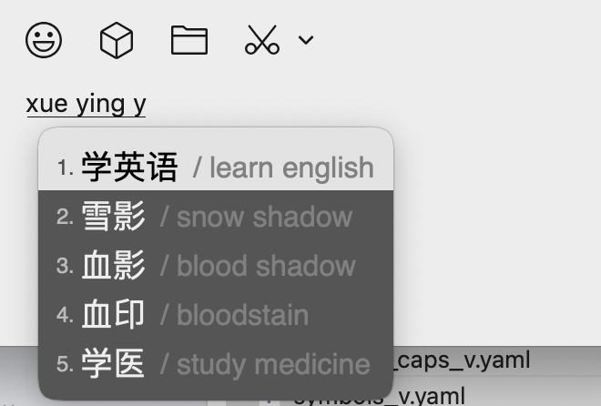
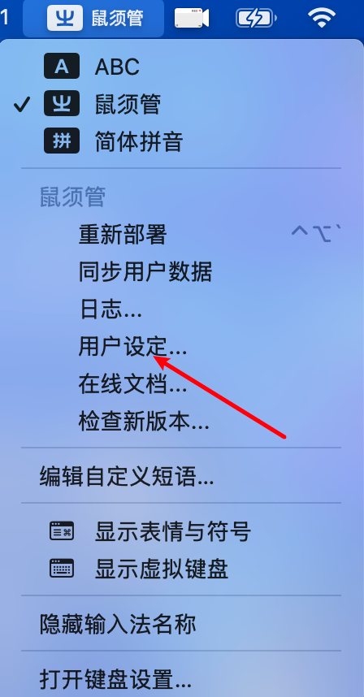
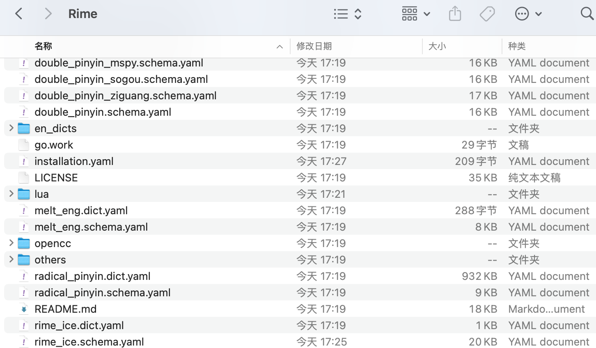
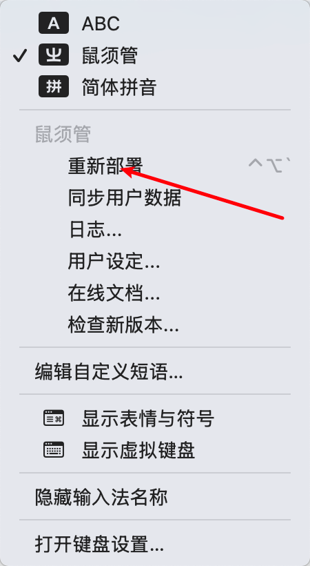

# Rime 中英文注释输入法

> 基于 [雾凇拼音](https://github.com/iDvel/rime-ice) 的二次改进版本，增加了中英文对照注释功能

<br>
一个为 Rime 输入法添加中英文对照注释的方案，帮助用户在输入中文时查看对应的英文翻译。

## 功能特性

### 中英文对照注释

在使用中文输入法时，候选词会自动显示对应的英文翻译或注释，方便用户：
- 学习和记忆中英文对照
- 快速确认词汇的准确含义
- 提高双语使用场景下的输入效率

**效果展示：**

当输入 `zhongwen` 时，候选框会显示：
（`Shift + Space` 可切换英文输出）
```
1. 中文 / chinese
2. 中午 / noon
3. 中外 / china-foreign
4. 中国网 / china.org.cn
5. 中广网 / cnr website
```



每个中文候选词后都会以灰色文字显示其对应的英文翻译，帮助用户理解和选择。

## 使用说明

### 基本使用

正常使用中文输入法输入拼音，候选词会自动显示英文注释，无需额外操作。

### 安装与部署

按以下步骤完成替换与部署：

1. 打开输入法的“用户设定”目录。
2. 备份后删除原有配置数据。
3. 将本仓库内容复制到用户目录。
4. 重新部署（重新加载）输入法配置。

#### 步骤示意图

**1）进入用户设定目录**



**2）删除旧配置并复制仓库文件**



**3）重新部署生效**



## 技术说明

本方案通过 Lua 插件扩展 Rime 输入法功能，在候选词生成过程中动态添加英文注释信息，不影响原有的输入和选词逻辑。

## 许可证

详见 [LICENSE](LICENSE) 文件。